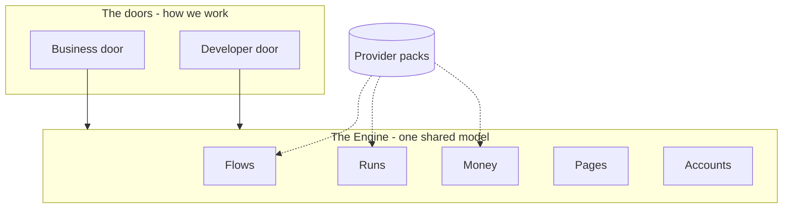

# Monnify Studio - The map

> Two maps, one system. The **team map** (§1) says who focuses where; it is the
> half page everyone reads. The **engine map** (§3) says where the walls are;
> read it when you build inside the Engine. Locks **D22-D25**, completes
> **D13**. ENGINEERING_STANDARDS.md stays the arbiter: if anything here adds
> complexity without earning it, it loses.

**How this doc got here.** The first draft put five architect-named domains at
the top level. The team pushed back: hard to understand, and it did not help
anyone narrow focus. The pushback was right about the map and the draft was
right about the walls, and NAMING.md settles how both can be true: the
dual-register rule (one code symbol under two surface words) means the doors
already share a single model. So: doors for people, walls for the model.

---

## 1. The team map (the half page)

| Area | Who | What lives here |
|---|---|---|
| **Business door** | Gloria, Godswill | onboarding, dashboard, shop / invoice / ajo surfaces, business-register copy |
| **Developer door** | Claret, Israel | whiteboard, code tab, run and trace, deploy |
| **Engine** | Claret owns, everyone reads | flows, runs, money, pages, accounts (§3) |
| **Provider packs** | whoever integrates the next provider | Monnify today, Paystack next (§4) |

Two rules that hold in every area, no exceptions:

1. **Only Money says "paid."** Nothing outside the Money wall may mark anything
   verified, settled, or received. Need to know? Read Money's read model. Need
   to change money? Send Money a command.
2. **The five review checks (§7).** One minute per PR. They catch the exact
   class of bug we have already paid for four times (§6).

That is the whole map for daily work. Everything below is for engine and pack
work.



---

## 2. Decisions locked here

For the ADR log. (Note: the BUILD_PLAN.md table currently stops at D17 while
D18-D21 exist only in code and doc references; the log needs a catch-up pass
before these are pasted in. Tracked in #268.)

| # | Decision | Rationale |
|---|----------|-----------|
| D22 | **Two maps: doors for people, walls for the model.** Top level is Business door, Developer door, Engine, Provider packs. Inside the Engine, five walls: Flows, Runs, Money, Pages, Accounts. | The team narrows focus by door; the bugs cluster at the engine walls (§6). Both needs are real and they answer different questions. Doors cannot be model boundaries because NAMING.md's dual-register rule already commits both doors to one shared model - one code symbol under two surface words. Separate models would mean two code symbols, which nobody wants. |
| D23 | **A provider pack has six members**: node types, adapter, codegen, credentials schema, safety-tag bindings, buyer-facing copy. `register_pack` is the only seam. | Completes D13. Monnify knowledge currently lives in five modules that are not the pack (§4); a second provider today means five scattered edits. Six members is what it actually takes to add Paystack without touching the Engine. |
| D24 | **Pages are downstream of Flows.** A page spec is born from a flow (goal plus money pillars), then freely edited, stored as **generated base + user overrides** kept separate. Blank-canvas authoring exists but is the escape hatch, not the front door. | The dependency already runs this way in code. Bindings to verified money are the moat a generic page builder cannot copy. And a business owner must never meet a blank canvas - that is the gate we exist to remove (#105). Base plus overrides lets a flow change without clobbering edits or going stale. |
| D25 | **Bindings are references, never values.** A page spec names a read-model field (`totals.money_in`); it may never carry a resolved number, a credential, or a row of data. The validator rejects literals in binding positions. | The free tier publishes specs. A spec that inlines real figures publishes a business's books. This makes the spec/data split a security boundary, not a style preference. |

---

## 3. The engine walls

Five walls. Plain words, same register as NAMING.md.

| Wall | Owns | Invariant | Must never |
|------|------|-----------|------------|
| **Flows** | IR, node catalog, analyzer, remediation, codegen, Moni compose | a flow is well-typed and its safety properties are decidable *before* it runs | know what a naira is, or that Monnify is a live endpoint |
| **Runs** | engine, adapters, run records, events, code sandbox | every run yields an honest, ordered, replayable trace; an output never claims more than the adapter observed | invent a value it did not receive |
| **Money** | orders, invoices, ajo pots, payouts, exact Decimal, provider client, credentials, read models | nothing is `verified` without provider confirmation; money is exact to the kobo (D21) | accept a status from anywhere but the provider |
| **Pages** | page spec language, validator, widget catalog, React compiler, serving | a spec is authored intent, versioned, pure data | contain executable code or resolved data |
| **Accounts** | who owns what, who may see what, what they paid for | visibility is an authorization decision made in one place | be inferred from where a spec happens to live |

What crosses the walls, and what must not:

| From → To | Crosses | Must not |
|---|---|---|
| Flows → Runs | an immutable analyzed `Workflow` plus adapter choice | Runs editing the graph |
| Runs → Money | intents ("initialize this", "record this payout") | Runs asserting `verified` |
| Money → Runs | verification results, as events | Money reaching into node config |
| Flows → Pages | goal and money pillars, to seed a spec | Flows knowing a widget exists |
| Money → Pages | named read-model fields only | raw tables or resolved values (D25) |
| Pages → Money | commands (create invoice, record contribution) | direct writes |
| Accounts → all | owner, visibility, plan | any wall keeping its own copy of "is this public" |

`integrations/monnify/client.py` is the anti-corruption layer and lives inside
Money *(shipped)*.

Shared plumbing that is mechanism, not a wall: the versioned spec store
(`store.py` already versions workflows; generalize once and both Flows and Pages
get save / history / rollback), the AI provider chain (`ai/providers.py` moves
up from Flows before Pages generation becomes its second caller), the money
type (D21), channels (WhatsApp, email), observability (D15).

---

## 4. Provider packs: finishing D13

D13 locked "provider-agnostic core; Monnify is a rich provider pack." Current
truth, by count of `monnify` mentions per module:

| Module | Mentions | Verdict |
|---|---|---|
| `providers/` | 44 | **correct** - this *is* the pack |
| `integrations/monnify/` | 35 | **correct** - this *is* the ACL |
| `analysis/` | 6 | **clean** - the engine reasons only over capability tags, never `type` strings (D3) |
| `ir/` | 8 | **clean** - a workflow declaring its provider is by design |
| `remediation/` | 2 | **clean** |
| `templates/` | 31 | leak - vetted flows wire `monnify.*` nodes directly |
| `executor/adapter.py` | 30 | leak - `SandboxAdapter` branches on `monnify.*` types |
| `codegen/python.py` | 27 | leak - emits Monnify base URL, auth, contract code |
| `artifacts/` | 23 | leak - buyer copy says "verified with Monnify" |
| `credentials.py` | 4 | leak - contract code, key, wallet are Monnify-shaped |

**D13 is roughly two-thirds honoured, and the hard third is the done third.**
The analyzer core is genuinely neutral - D3 bought that. The five leaks are all
outer ring.

The six-member contract (D23):

```
ProviderPack
  node_types          what blocks appear on the whiteboard
  adapter             how each node type executes live
  codegen             how each node type renders to code
  credentials_schema  what keys this provider needs
  safety_bindings     which node types carry which capability tag
  copy                buyer-facing trust strings
```

`safety_bindings` is the subtle member and the reason the moat travels: safety
rules ask "is a node carrying `VERIFIES_PAYMENT` reachable before one carrying
`FULFILS_ORDER`", and the pack answers which of *its* nodes carry that tag. The
rules are payment truths, not Monnify truths, so they port to the next provider
unchanged. That is the most valuable property in this document.

Resolution is `pack_for(workflow_id)`, mirroring the shipped
`credentials.settings_for(workflow_id)`. Single-tenant returns a constant,
multi-tenant does a lookup, same interface either way - which is why §8 can
defer the tenancy question for free.

---

## 5. Pages (D24, D25)

Two compilers over one safety story:

| | Authored spec | Validated by | Compiled to | Run by |
|---|---|---|---|---|
| Flows | IR (blocks and edges) | analyzer, safety rules | Python | Runs |
| Pages | JSON / YAML | schema plus binding checks | React | the browser |

**Downstream, not peer.** Already true in code
(`fetchWorkflowDashboard(workflowId)`, `generateArtifact(workflowId, config)`,
`share_kind` derived from goal). Decoupling pages from flows would discard the
one thing Framer and v0 cannot copy: bindings to money that was actually
verified. Downstream in dependency, peer in craft - the spec is a real
language: versioned, hand-editable, ejectable to React, publishable.

**Generate-then-override.** Born from the flow, then fully editable, stored as
generated base plus user overrides kept separate. Flow changes? Regenerate the
base, replay the overrides, surface what no longer applies. Same shape as the
shipped `{...previousNode.config, ...flowNode.data.config}` merge in
`flowIo.ts`, one level up.

**Widget catalog mirrors the node catalog.** Typed widgets with binding slots,
registered through the same seam, so the vocabulary stays data and outsiders
extend without forking.

**Interpret for editing, compile for ejecting.** Interpretation gives live
preview; real React codegen gives "take the code and walk away" - the same
promise flow codegen already makes.

**Public-by-default makes the spec a security surface (D25).** No credentials
in a spec, ever. Bindings are references, never resolved values. Generation may
not bake sample data into a saved spec. Specs are pure data - no expressions,
no JS - because a public gallery of code-carrying specs is an XSS channel;
logic lives in the widget catalog. The upside: specs born from flows make the
public gallery organised by goal (ajo, payroll, shop), each template arriving
with bindings already wired. Free-tier users become the template library.

---

## 6. Evidence: the walls are where the bugs were

Four bugs in one week, each a wall crossing. This is why the walls sit here and
not somewhere tidier.

| Symptom | Crossing | Fix |
|---|---|---|
| every notification claimed "NGN 10,000 received" | Runs fabricated a Money value: a demo default laundered through node outputs into a monetary claim | `amount_bound` provenance flag - an amount with no origin is not an amount |
| shop always rendered "My Business / Product / NGN 5,000" | Pages invented Money data because onboarding never passed the real values | pass real name and full catalog; the durable fix is a spec rich enough to carry intent |
| "generate invoice leads me in a loop" | a missing Pages → Money command, so the tab fell back to reopening the template picker (Flows) | invoice manager issues the command directly |
| invoice link labelled "Your shop link" | Pages not modelling its surfaces distinctly | hardcoded label for now; properly fixed by a typed page spec |

The doors did not cause these and could not have prevented them - every one
lived in the shared middle between the doors. That middle now has a name
(Engine), an owner, and walls.

---

## 7. The five review checks

One minute per PR, any area:

1. **A field lands in the flow IR because a widget needs it.** The Flows → Pages
   arrow has inverted. Flows must never learn widgets exist.
2. **A literal value sits in a binding position.** D25 violation.
3. **A provider name appears outside `providers/`, `integrations/`, or a pack
   member.** D13 violation - probably one of the five §4 leak sites growing.
4. **A default fills a gap that should be a required input.** The "My Business"
   and "NGN 10,000" failure mode. Ask whether the value has provenance, not
   whether it looks reasonable.
5. **Two places hold the same fact.** Information leakage (Standards §1.3).
   Decide which wall owns it.

---

## 8. Deferred on purpose

| Question | Why it can wait | What decides it |
|---|---|---|
| **Tenancy**: one deployment per fintech, or many providers in one? | `pack_for(workflow_id)` has the same interface under both answers (§4) | the first real conversation with a second fintech |
| **Saving pages: authorship or stability?** Do people edit surfaces, or does saving just pin a generation? | build pinning now on the authorship data model (base plus overrides) - costs nothing extra today | the first user who moves a widget |

---

## 9. Suggested order (none urgent before the studio is stable)

1. **Move `ai/` up to shared plumbing.** A folder move today, a refactor once
   page generation becomes its second caller.
2. **Generalize the versioned store** out of `store.py`, so saving pages reuses
   the flow mechanism instead of inventing a second one.
3. **Close the five D13 leaks**, smallest first: `credentials.py`, `artifacts/`
   copy, `codegen`, `executor/adapter.py`, `templates/`. Finish line: a
   `PaystackPack` that requires zero Engine edits.
4. **Type the page spec with D25 from the first commit.** Retrofitting
   references-not-values after public specs exist is not a refactor, it is a
   disclosure.
5. **Postgres (#81), Money first**, then Flows, then Pages. Money is where
   losing state costs something real; run traces can stay ephemeral longest.
