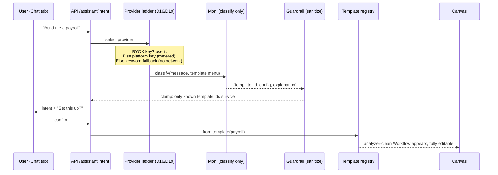
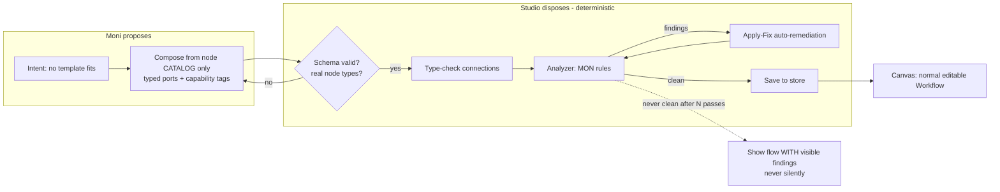
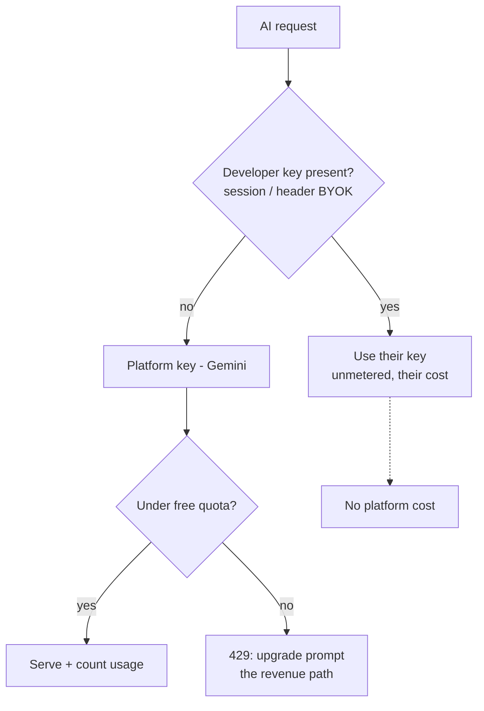

# Moni: system design

How the assistant turns "build me a payroll" into a safe, editable flow, and how
AI access is paid for. Decisions: D16 (tri-provider), D18 (Moni layers), D19
(credential tiers). Issues: #15 (floor + ceiling), #54 (payroll template).

The principle behind every diagram here: **Moni is trusted to be creative, never
to be correct.** Correctness lives in the vetted templates, the typed catalog,
and the analyzer. Whatever Moni produces passes through the same deterministic
gates as a hand-built flow (D3, Principle 2).

## 1. The floor: intent to vetted template (shipped, #64 + #54)

What happens today when a seller types "Build me a payroll":

Key properties:

- Moni picks from a **menu of vetted templates**; she never emits nodes here.
- The guardrail clamps any template id she invents to `unknown`, which becomes a
  clarifying question, never a broken build. (Before #54 registered the payroll
  template, "payroll" itself was clamped; that gap is now closed.)
- With **no key at all**, the keyword fallback still routes correctly, so the
  demo can never be taken down by a provider outage (D11 instinct).

## 2. The ceiling: Moni composes a flow (next, #15)

When no template fits ("collect caution fees from tenants, refund on move-out"):

Why this is safe to build:

- Moni is fed the **catalog**, not prose docs: she can only use node types that
  exist, and edges must type-check. The catalog is already a typed graph (D13),
  so no RAG is needed for construction.
- Every composed graph runs the **same analyzer** as hand-built ones; Apply-Fix
  repairs what it catches. AI proposes, the analyzer disposes.
- The result lands through the same store/canvas path as from-template, so it
  is draggable and adjustable like anything else. No new frontend plumbing.
- Failure mode is honest: if remediation cannot reach clean, the flow appears
  with its findings showing, exactly like an unsafe hand-built flow would.

## 3. Paying for it: credential tiers (D19)

- **Non-technical users** (the seller in Chat) ride the platform key, metered
  per user; past the free tier they pay. That is the monetization path.
- **Developers** bring their own key: it wins over the platform key and is
  never metered by us.
- The platform key lives server-side only, redacted in logs (D15); the browser
  never sees any key.
- Scope note: for the challenge build, D19 is recorded and pitched; the meter
  itself is post-deadline plumbing.

## 4. Guardrail ladder (all layers, one view)

| # | Gate | Deterministic? | Catches |
|---|------|----------------|---------|
| 1 | Structured output schema | yes | malformed model output |
| 2 | Template-id clamp (floor) | yes | invented templates |
| 3 | Catalog-only composition (ceiling) | yes | invented node types |
| 4 | Typed connection check | yes | nonsense wiring |
| 5 | Analyzer (MON rules) | yes | unsafe payment architecture |
| 6 | Apply-Fix remediation | yes | repairable findings |
| 7 | Visible findings on canvas | yes | anything that survives 1-6 |

Moni is additionally fenced off from the money path: she cannot mark orders
paid, cannot call verify, and never sees secrets. The verification and orders
flow (#53) has no AI in it at all.
